# 数据记录应用 (Time Tracker / Data Record App) 详细设计方案

## 1. 项目概述

### 1.1 背景与目标
本项目是一款基于 **Flutter** 开发的高灵活性、轻量级个人时间点与事件追踪移动端应用（支持 Android / iOS / 桌面端）。
应用专为记录生活、健康、工作中的各类事件而设计，不仅支持**瞬时打卡型事件**（如喝水、服药、记灵感），而且深度支持**持续时段/症状发作型事件**（以**偏头痛**、痛经、睡眠、运动、设备故障等为典型场景），记录**发作开始时间、结束时间、持续时长、发作诱因、缓解应对方式、严重等级**等关键信息，并通过 ECharts 可视化图表挖掘事件发生规律与健康/生活趋势。

### 1.2 核心设计原则
1. **纯本地离线运行**：无需后端服务器，零网络依赖，数据 100% 保存在本地文件/存储库中，保障私密健康数据安全。
2. **多模式事件适配**：统一抽象「瞬时点打卡」与「持续时段/多维度记录」两种模式，支持用户高度自定义扩展。
3. **多维度 ECharts 图表**：顶部直观呈现持续时长、发作频次、24小时发作时段分布、诱因与缓解方式统计等分析图表。
4. **进行中状态跟踪**：针对时段型事件（如偏头痛发作），支持“开始发作 -> 实时计时 -> 结束发作并归纳记录”的闭环体验。
5. **开箱即用与灵活导出**：支持 JSON/CSV 本地一键备份与分享还原。

---

## 2. 典型业务场景与案例分析

### 案例 1：偏头痛（Migraine）发病规律追踪（持续时段型）
- **发作起点**：2026-09-20 14:15 开始出现单侧跳痛、畏光。
- **发病前因（诱因 Triggers）**：昨晚熬夜、下午喝了高浓度冰美式、工作压力大。
- **发病严重度（Severity）**：疼痛等级 8 / 10（剧烈搏动性疼痛）。
- **缓解手段（Relief Methods）**：口服布洛芬 400mg、暗室平躺冷敷 1 小时。
- **发作终点**：2026-09-20 17:30 疼痛完全缓解。
- **持续时长（Duration）**：3 小时 15 分钟（系统自动计算）。
- **ECharts 分析价值**：
  - 折线图展示每周/每月偏头痛发作频次与单次持续时长变化趋势；
  - 散点分布图分析发作最集中的时间段（如往往在周五下午或午后 14:00~16:00）；
  - 诱因 Top 排名直观揭示“熬夜”与“咖啡因”是主要致病诱因。

### 案例 2：日常习惯与体征打卡（瞬时发生型）
- 如：喝水（250ml）、服药（降压药1片）、灵感记录、体重记录、吸烟记录等，单次时间点一键记录。

---

## 3. 系统技术选型

| 模块 | 技术选型 | 说明 |
| :--- | :--- | :--- |
| **基础框架** | Flutter 3.x + Dart 3.x | 跨平台移动端/桌面端开发 |
| **UI 规范** | Material 3 (Material You) | 现代卡片式、自适应浅色/深色主题 |
| **设计智库** | UI/UX Pro Max 规范库 | 触控靶心 ≥44px、无障碍色差、层级渐进展开 |
| **状态管理** | `provider` / `riverpod` | 响应式状态流、支持局部刷新与计时器驱动 |
| **图表可视化** | `flutter_echarts` / ECharts 5.x | 高性能可视化引擎，支持双轴折线图、甘特时段图、热力散点图 |
| **本地文件存储** | `path_provider` + 本地分层 JSON | 安全原子写入（.tmp 重命名机制）、免服务端依赖 |
| **辅助组件库** | `intl`, `uuid`, `flutter_colorpicker`, `share_plus` | 日期格式化、UUID生成、调色板、本地分享导出 |

---

## 4. 功能架构与模块设计

```mermaid
flowchart TD
    App[数据记录 App]
    
    App --> HomeModule[1. 首页模块 - 事件看板]
    App --> DetailModule[2. 事件详情模块 - 图表与记录]
    App --> RecordEditor[3. 记录编辑与追踪 - 时段/诱因/缓解]
    App --> StorageModule[4. 本地文件存储与备份]

    HomeModule --> EventList[事件任务列表: 瞬时打卡 / 时段跟踪]
    HomeModule --> OngoingBanner[进行中事件横幅: 实时发作计时与快捷结束]
    HomeModule --> EventCreate[创建/自定义事件类型与预设标签]

    DetailModule --> EChartsArea[顶部 ECharts 多维可视化图表]
    DetailModule --> StatsCard[统计概览: 平均时长/发作频率/最高诱因]
    DetailModule --> RecordTimeline[底部历史记录时间轴列表]

    RecordEditor --> TimePicker[开始时间 & 结束时间选择 / 自动算时长]
    RecordEditor --> TriggerSelector[发作诱因多选/新增 Tags]
    RecordEditor --> ReliefSelector[缓解方式多选/新增 Tags]
    RecordEditor --> SeveritySlider[疼痛/严重程度评级 1-10 评分]
    RecordEditor --> DescriptionInput[伴随症状与详细描述输入]

    StorageModule --> SafeJsonIO[JSON 文件分层原子读写]
    StorageModule --> BackupRestore[数据导出/导入备份 .json/.csv]
```



---

## 5. 详细界面与交互设计

### 5.1 首页：事件任务列表 (Home Screen)
- **顶部 AppBar**：
  - 应用标题；
  - 搜索栏（支持快速过滤事件）；
  - 全局数据备份、导出与设置入口。
- **进行中事件状态栏 (Ongoing Card)**：
  - 若有持续型事件处于“进行中”（如偏头痛正在发作），在首页顶部以醒目的呼吸动效卡片展示：
    > ⚠️ **偏头痛发作中** | 已持续 `01:45:20` | [ 结束发作并记录 ]
- **事件卡片列表 (Event Cards)**：
  - **瞬时型卡片**：
    - 图标、名称、今日打卡次数、最近一次打卡时间。
    - 快速操作：右侧 `+ 快速打卡` 按钮。
  - **持续时段型卡片**：
    - 图标、名称、本月发作次数、平均发作持续时长（如 "平均 2.5 小时"）、最近发作时间。
    - 快速操作：若未发作提供 `▶ 开始发作` 按钮；若发作中提供 `⏹ 结束` 按钮。
- **底部浮动操作按钮 (FAB)**：
  - `+ 新建事件`：支持配置事件名称、分类、事件模式（瞬时 vs 时段）、预设诱因库、预设缓解方式库、度量单位等。

---

### 5.2 事件详情页 (Event Detail Screen)

```
+-------------------------------------------------------------+
| <  偏头痛记录                                   [设置] [导出] |
+-------------------------------------------------------------+
| 📊 统计看板                                                 |
| 本月发作: 4 次  |  平均时长: 2h 45m  |  高频诱因: 熬夜, 咖啡因  |
+-------------------------------------------------------------+
| 📈 ECharts 多维可视化区域 (高度 260px)                       |
| [ 7天 ] [ 30天 ] [ 90天 ] | 模式: [ 持续时长/频次 ] [ 时段分布 ] [ 诱因分析 ]
| ----------------------------------------------------------- |
|   (ECharts 动态折线图: X轴为日期，Y轴为时长(小时)，点大小为严重度)   |
+-------------------------------------------------------------+
| ⚡ 操作栏: [ ▶ 开始新发作 / + 补录历史记录 ]                 |
+-------------------------------------------------------------+
| 📋 历史记录时间轴 (按时间倒序)                               |
|                                                             |
|  2026-09-20                                                 |
|  ┌────────────────────────────────────────────────────────┐ |
|  │ 🕒 14:15 ~ 17:30 (持续 3h 15m)    🔴 疼痛等级: 8/10     │ |
|  │ 🎯 诱因: [熬夜] [冰美式咖啡] [工作压力]                 │ |
|  │ 💊 缓解: [布洛芬400mg] [暗室冷敷]                        │ |
|  │ 📝 描述: 下午开会时右侧太阳穴剧烈搏动，伴随畏光恶心      │ |
|  │                                      [编辑] [删除]     │ |
|  └────────────────────────────────────────────────────────┘ |
|                                                             |
|  2026-09-12                                                 |
|  ┌────────────────────────────────────────────────────────┐ |
|  │ 🕒 09:30 ~ 11:00 (持续 1h 30m)    🟠 疼痛等级: 5/10     │ |
|  │ 🎯 诱因: [天气骤降]  |  💊 缓解: [闭目休息]              │ |
|  └────────────────────────────────────────────────────────┘ |
+-------------------------------------------------------------+
```

---

### 5.3 记录新增/编辑弹窗 (Record Form Modal)

表单根据事件类型动态展现字段：

#### 持续时段型表单（如偏头痛、睡眠、运动）：
1. **时间区间选择**：
   - **开始时间**：年-月-日 时:分（支持选择历史时间或填入“当前”）；
   - **结束时间**：可留空（标记为“发作进行中”），或选择结束时间；
   - **持续时长**：选择起止时间后自动显示 `X小时X分`，亦支持手动微调。
2. **严重程度 / 疼痛等级（Severity Rating）**：
   - 1 ~ 10 级滑块（附带颜色与文案：1-3 轻微/可忍受 🟢，4-6 中度/影响工作 🟠，7-10 剧烈/卧床不能 🔴）。
3. **发病诱因（Triggers）**：
   - 标签选择器（Tag Chips），展示事件预设的常用诱因（如：`熬夜`、`天气突变`、`咖啡/酒精`、`压力大`、`强光刺激`、`跳餐/低血糖`），支持点击快速选中，并支持在输入框即时输入新诱因生成标签。
4. **缓解方式（Relief Methods / Solutions）**：
   - 标签选择器，展示常用缓解手段（如：`布洛芬`、`对乙酰氨基酚`、`暗室平躺`、`冷敷头部`、`补充电解质`、`睡眠`），支持多选与自定义新增。
5. **伴随症状与详细描述（Symptoms & Notes）**：
   - 多行文本输入（如：恶心、视物模糊、单侧跳痛等详细感受）。

#### 瞬时发生型表单（如喝水、日常打卡）：
- 发生时间点、数值（如 300ml）、简要描述与普通标签。

---

## 6. ECharts 深度可视化方案

针对偏头痛等规律分析场景，ECharts 组件提供 3 种可自由切换的图表模式：

### 模式一：发作频次与持续时长趋势折线图 (Duration & Frequency Trend)
- **X 轴**：日期时间序列（`09-01`, `09-05`, `09-12`, `09-20` 等）；
- **主 Y 轴（左侧折线）**：每次发作持续时长（以小时或分钟计），采用平滑曲线与阴影面积；
- **散点大小/颜色**：节点标记大小映射疼痛等级（如 8 级为大红点，3 级为小绿点）；
- **Tooltip 悬浮窗**：悬停或触碰节点时，详细浮现该次发作的起止时间、持续时长、疼痛等级及主要诱因与缓解药物。

```javascript
// ECharts Option 结构示例
{
  tooltip: {
    trigger: 'item',
    formatter: function(params) {
      const data = params.data;
      return `<b>${data.date} 偏头痛发作</b><br/>` +
             `持续时长: ${data.durationText}<br/>` +
             `疼痛等级: ${data.severity}/10<br/>` +
             `主要诱因: ${data.triggers.join(', ') || '无'}<br/>` +
             `缓解方式: ${data.reliefMethods.join(', ') || '无'}`;
    }
  },
  xAxis: { type: 'category', data: ['09-05', '09-12', '09-20', '09-22'] },
  yAxis: { type: 'value', name: '持续时长(小时)', minInterval: 0.5 },
  series: [{
    type: 'line',
    smooth: true,
    data: [
      { value: 1.5, date: '09-05', durationText: '1h 30m', severity: 4, triggers: ['压力'], reliefMethods: ['休息'] },
      { value: 4.0, date: '09-12', durationText: '4h 00m', severity: 9, triggers: ['熬夜', '咖啡'], reliefMethods: ['布洛芬'] },
      { value: 3.25, date: '09-20', durationText: '3h 15m', severity: 8, triggers: ['熬夜', '强光'], reliefMethods: ['布洛芬', '冷敷'] }
    ],
    symbolSize: function (val, params) {
      return (params.data.severity || 5) * 2; // 疼痛越剧烈，散点越大
    }
  }]
}
```

### 模式二：24 小时一天中发作时刻分布散点/热力图 (24h Time-of-Day Heatmap)
- **X 轴**：日期；
- **Y 轴**：一天中的 24 小时（00:00 ~ 24:00）；
- **展示目标**：直观展示发病是否具有时间节律性（例如总是集中在清晨醒来或下午 14:00~16:00）。

### 模式三：诱因排行与缓解效果横向条形图 (Triggers & Relief Top Ranking)
- 汇总统计所有发作历史中诱因的出现频次（如：熬夜 60%、压力 40%、咖啡 25%）；
- 汇总最有效的缓解手段（如：布洛芬缓解占比 80%、冷敷 45%）。

---

## 7. 数据结构与本地 JSON Schema

### 7.1 事件类型定义 (`EventModel`)
```json
{
  "id": "evt_migraine_001",
  "name": "偏头痛发作记录",
  "description": "记录偏头痛发作起止时间、诱因、严重程度及缓解方法",
  "type": "duration",                     // "instant" (瞬时) 或 "duration" (时段型)
  "icon": "brain",                        // 对应 Flutter Icon
  "color": "#E91E63",                     // 主题色 Hex
  "unit": "小时",                         // 度量单位 (可选)
  "hasSeverity": true,                    // 是否启用严重度/疼痛评分 (1-10)
  "presetTriggers": ["熬夜", "工作压力", "咖啡因", "天气剧变", "强光刺激", "睡眠不足", "跳餐"],
  "presetReliefMethods": ["布洛芬", "对乙酰氨基酚", "暗室冷敷", "闭目休息", "喝温水", "补充电解质"],
  "createdAt": 1790000000000,
  "updatedAt": 1790050000000
}
```

### 7.2 记录模型定义 (`RecordModel`)
```json
{
  "id": "rec_20260920_001",
  "eventId": "evt_migraine_001",
  
  // 时间与时长
  "startTime": 1790060100000,             // 开始发生时间戳 (必填)
  "endTime": 1790071800000,               // 结束时间戳 (若在发作中可为 null)
  "durationMinutes": 195,                 // 持续时长 (分钟，自动计算: 3小时15分)
  "isOngoing": false,                     // 是否处于进行中状态

  // 症状与多维特征
  "severity": 8,                          // 严重程度/疼痛等级 1~10 (可选)
  "triggers": ["熬夜", "咖啡因", "工作压力"], // 发病诱因列表
  "reliefMethods": ["布洛芬", "暗室冷敷"],    // 缓解手段/应对方式列表
  
  // 基础补充
  "value": 3.25,                          // 数值指标 (对应持续小时数 3.25h，便于图表读取)
  "remark": "下午开会时右侧太阳穴剧烈搏动性跳痛，畏光畏声，伴轻微恶心",
  "tags": ["右侧跳痛", "畏光", "中度恶心"],
  "createdAt": 1790060105000,
  "updatedAt": 1790071810000
}
```

### 7.3 本地文件目录组织

```
<AppDocDir>/
└── data_store/
    ├── app_config.json                   # 应用偏好设置 (主题、图表默认范围)
    ├── events.json                       # 所有事件定义的列表
    └── records/
        ├── evt_migraine_001.json         # 偏头痛专属记录文件
        ├── evt_water_002.json            # 喝水打卡记录文件
        └── evt_xxxxxx.json
```

---

## 8. 代码工程架构 (Flutter)

```
lib/
├── main.dart                             # 应用入口
├── app.dart                              # 路由与全局 MaterialApp
├── core/
│   ├── theme/                            # Material 3 主题配色
│   ├── utils/                            # 日期转换、持续时间格式化(2h 15m)、安全文件写入
│   └── constants/                        # 图标映射、默认颜色
├── models/
│   ├── event_model.dart                  # 事件实体 (支持 instant / duration 模式)
│   └── record_model.dart                 # 记录实体 (支持起止时间、诱因、缓解方式、疼痛评级)
├── repositories/
│   ├── storage_service.dart              # 本地 JSON 文件原子 I/O 驱动
│   ├── event_repository.dart             # 事件定义管理仓储
│   └── record_repository.dart            # 记录数据增删改查与统计聚合
├── providers/
│   ├── event_provider.dart               # 事件列表与进行中状态 Provider
│   └── record_provider.dart              # 记录数据与统计分析 Provider
├── widgets/
│   ├── charts/
│   │   ├── echarts_container.dart        # Flutter ECharts 容器封装
│   │   ├── duration_trend_chart.dart     # 持续时长与频次折线图
│   │   ├── time_of_day_chart.dart        # 24小时时段分布图
│   │   └── trigger_rank_chart.dart       # 诱因与缓解排行条形图
│   ├── tags/
│   │   └── tag_chips_selector.dart       # 诱因/缓解方式标签多选与新增选择器
│   ├── severity_slider.dart              # 1-10 级疼痛/严重度滑块组件
│   └── duration_timer_widget.dart        # 进行中事件实时计时器组件
└── screens/
    ├── home/
    │   ├── home_screen.dart              # 首页
    │   ├── widgets/
    │   │   ├── ongoing_event_banner.dart # 顶部正在发作/进行中事件横幅
    │   │   ├── event_card_view.dart      # 事件卡片
    │   │   └── event_form_dialog.dart    # 新建/编辑事件弹窗
    ├── detail/
    │   ├── event_detail_screen.dart      # 详情页
    │   ├── widgets/
    │   │   ├── chart_section.dart        # ECharts 图表展示与切换区
    │   │   ├── record_timeline_tile.dart # 历史记录条目 (显示起止、时长、诱因、缓解方式)
    │   │   └── record_form_sheet.dart    # 新增/补录记录多维表单 (Bottom Sheet)
    └── settings/
        └── backup_screen.dart            # 本地数据导出/导入备份管理
```

---

## 9. 演进与实施步骤

1. **第一阶段：核心模型与本地持久化扩展**
   - 完善 `EventModel` 与 `RecordModel`（支持 `instant` 与 `duration` 模式，增加 `triggers`、`reliefMethods`、`severity`、`startTime`、`endTime`）。
   - 实现本地 JSON 文件的健壮分层读写与聚合统计。
2. **第二阶段：偏头痛等多维表单与进行中计时**
   - 实现「发作中实时计时」与「一键结束发作」功能；
   - 实现包含起止时间选择、1-10 级疼痛滑块、诱因多选 Tag、缓解方式多选 Tag 的弹性表单。
3. **第三阶段：ECharts 复合折线图与时段分析**
   - 集成 ECharts 实现持续时长曲线、散点大小映射严重度、Tooltip 悬浮诱因展示；
   - 提供近7天/30天/全部时段筛选。
4. **第四阶段：时间轴列表与数据备份导出**
   - 实现带诱因/缓解方式胶囊标签的丰富时间轴列表；
   - 增加本地 JSON 数据打包导出与恢复功能。
