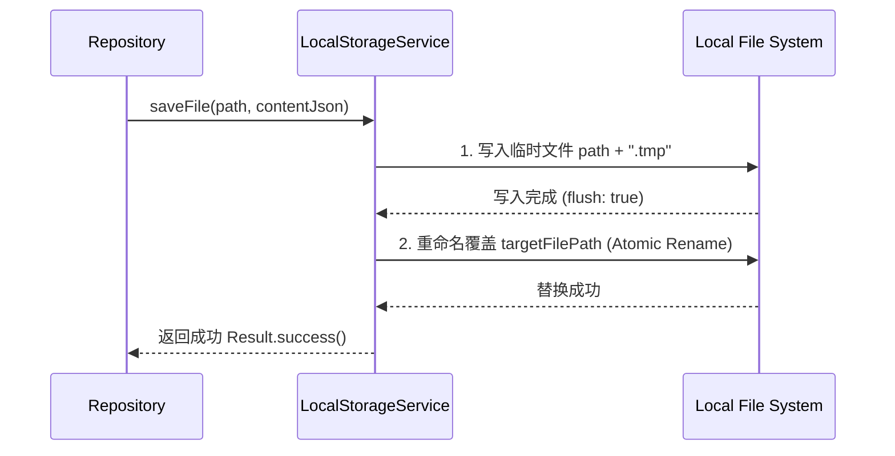
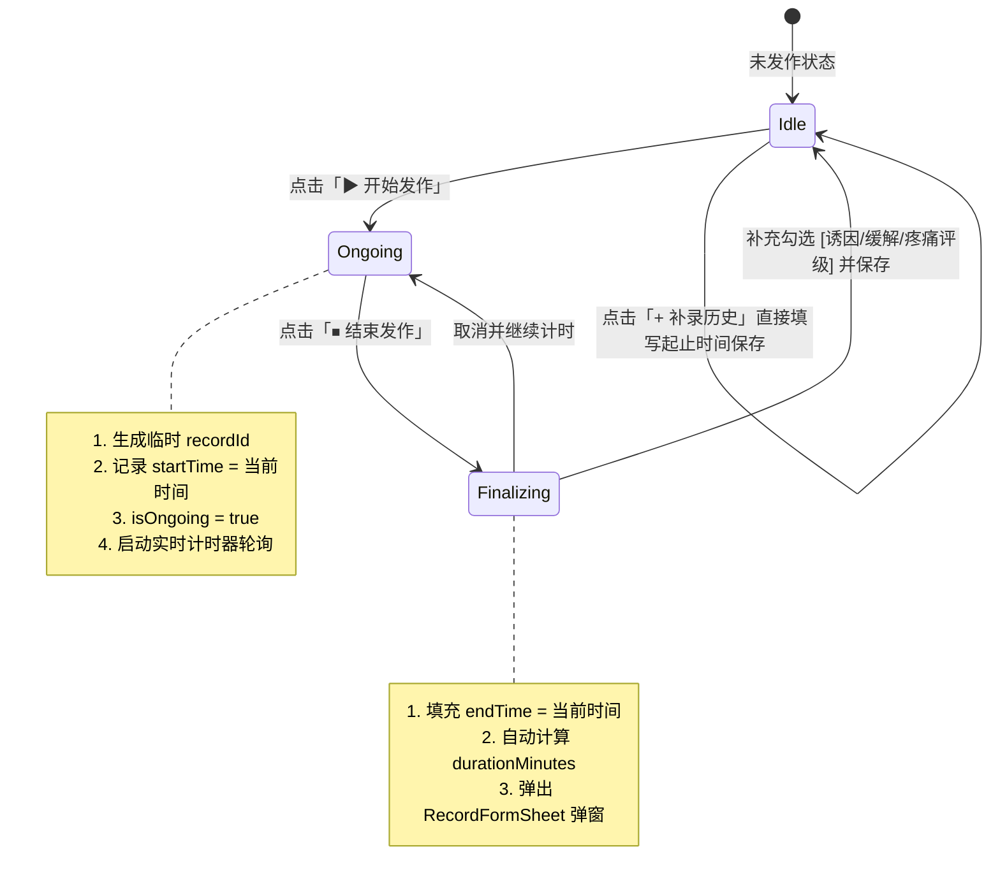

# 数据记录应用 (Data Record App) 详细设计说明书

## 1. 文档概述

### 1.1 编写目的
本文档为「数据记录应用（Flutter 版）」的**详细设计说明书**。在概要设计的基础上，本文档对系统的软件分层架构、数据模型类定义、本地文件原子存储规范、状态管理流转、ECharts 图表动态生成逻辑、UI 交互状态机及各功能模块接口进行精确定义，作为后续编码实现与单元测试的标准依据。

### 1.2 适用范围
- 目标平台：Android / iOS / macOS / Windows / Linux (Flutter 跨平台)
- 运行环境：Flutter 3.x, Dart 3.x, 纯离线无服务端

---

## 2. 系统总体架构设计

应用采用标准的 **分层架构（Layered Architecture）**，保证视图、业务逻辑与底层文件 I/O 的完全解耦：

```
+-------------------------------------------------------------------------+
|                          Presentation Layer (表现层)                     |
|  - Screens (Home, Detail, Settings, Backup)                             |
|  - Modals & Sheets (EventFormDialog, RecordFormSheet)                   |
|  - Custom Widgets (EChartsContainer, SeveritySlider, TagChipsSelector)  |
+-------------------------------------------------------------------------+
                                    │
                                    ▼
+-------------------------------------------------------------------------+
|                      State Management Layer (状态管理层)                  |
|  - EventProvider: 事件列表、进行中计时器、搜索与过滤                     |
|  - RecordProvider: 记录 CRUD、分组时间轴、ECharts 数据转换、统计聚合     |
|  - AppConfigProvider: 主题、偏好设置、全局配置                           |
+-------------------------------------------------------------------------+
                                    │
                                    ▼
+-------------------------------------------------------------------------+
|                        Domain / Model Layer (领域模型层)                 |
|  - EventModel, RecordModel, ChartDataPoint, StatisticsSummary           |
|  - Business Rules (起止时长校验、发作频率计算、诱因归纳算法)            |
+-------------------------------------------------------------------------+
                                    │
                                    ▼
+-------------------------------------------------------------------------+
|                      Data / Storage Layer (数据持久化层)                 |
|  - EventRepository, RecordRepository, ConfigRepository                  |
|  - LocalStorageService: 专用 JSON 文件读写、临时文件原子覆盖、并发安全锁 |
|  - BackupService: 数据包导出 (.json 压缩包) 与数据导入校验恢复          |
+-------------------------------------------------------------------------+
```

---

## 3. 详细数据模型与类设计 (Domain Models)

### 3.1 枚举定义

```dart
/// 事件记录模式
enum EventType {
  /// 瞬时发生型 (如喝水、吃药打卡、记灵感)
  instant,
  /// 持续时段/症状型 (如偏头痛、睡眠、运动、设备故障)
  duration,
}

/// 疼痛/严重程度等级
enum SeverityLevel {
  none(0, '无', Colors.grey),
  mild(1, '轻微', Colors.green),       // 1 - 3
  moderate(2, '中度', Colors.orange),  // 4 - 6
  severe(3, '重度', Colors.red),       // 7 - 10
  ;

  final int code;
  final String label;
  final Color color;
  const SeverityLevel(this.code, this.label, this.color);

  static SeverityLevel fromValue(int? val) {
    if (val == null || val <= 0) return SeverityLevel.none;
    if (val <= 3) return SeverityLevel.mild;
    if (val <= 6) return SeverityLevel.moderate;
    return SeverityLevel.severe;
  }
}
```

### 3.2 `EventModel`（事件任务模型）

```dart
class EventModel {
  final String id;                    // UUID v4, 格式 "evt_xxxx"
  final String name;                  // 事件名称 (如: "偏头痛记录", "喝水打卡")
  final String description;           // 事件描述或备注要求
  final EventType type;               // 事件类型 (instant / duration)
  final String iconCodePoint;         // 图标 codePoint 标识
  final int colorHex;                 // 主题颜色 Hex 值 (如 0xFFE91E63)
  final String? unit;                 // 度量单位 (如 "ml", "小时", "次")
  final double? defaultValue;         // 默认数值 (如 250)
  final bool hasSeverity;             // 是否启用 1-10 级严重度/疼痛评分
  final List<String> presetTriggers;  // 预设发作诱因候选库 (如: ["熬夜", "咖啡", "强光"])
  final List<String> presetReliefMethods; // 预设缓解方式候选库 (如: ["布洛芬", "冷敷"])
  final int createdAt;                // 创建时间戳 (毫秒)
  final int updatedAt;                // 更新时间戳 (毫秒)

  EventModel({
    required this.id,
    required this.name,
    this.description = '',
    this.type = EventType.instant,
    this.iconCodePoint = '0xe1d7', // 默认图标
    this.colorHex = 0xFF2196F3,
    this.unit,
    this.defaultValue,
    this.hasSeverity = false,
    this.presetTriggers = const [],
    this.presetReliefMethods = const [],
    required this.createdAt,
    required this.updatedAt,
  });

  Map<String, dynamic> toJson();
  factory EventModel.fromJson(Map<String, dynamic> json);
  EventModel copyWith({...});
}
```

### 3.3 `RecordModel`（事件记录模型）

```dart
class RecordModel {
  final String id;                    // UUID v4, 格式 "rec_xxxx"
  final String eventId;               // 关联的 EventModel ID
  
  // 时间维度
  final int startTime;                // 发生/开始时间戳 (毫秒, 必填)
  final int? endTime;                 // 结束时间戳 (毫秒, 为 null 表示发作进行中)
  final int? durationMinutes;         // 持续时长 (分钟，若为 null 则通过 (endTime - startTime) 计算)
  final bool isOngoing;               // 是否处于进行中状态

  // 多维属性 (偏头痛/症状分析)
  final int? severity;                // 严重程度/疼痛等级 (1 - 10)
  final List<String> triggers;        // 本次记录的诱发因素列表 (如 ["熬夜", "强光"])
  final List<String> reliefMethods;   // 本次记录的缓解应对方式 (如 ["布洛芬 400mg", "暗室平躺"])
  
  // 基础量化与描述
  final double? value;                // 数值度量 (如持续小时数 3.25h 或饮水量 300ml)
  final String remark;                // 详细描述/伴随症状 (如 "右侧跳痛，伴随轻微恶心")
  final List<String> tags;            // 补充标签
  final int createdAt;                // 记录创建时间戳
  final int updatedAt;                // 记录更新时间戳

  RecordModel({
    required this.id,
    required this.eventId,
    required this.startTime,
    this.endTime,
    this.durationMinutes,
    this.isOngoing = false,
    this.severity,
    this.triggers = const [],
    this.reliefMethods = const [],
    this.value,
    this.remark = '',
    this.tags = const [],
    required this.createdAt,
    required this.updatedAt,
  });

  /// 获取计算后的持续分钟数
  int get effectiveDurationMinutes {
    if (durationMinutes != null && durationMinutes! > 0) return durationMinutes!;
    if (endTime != null && endTime! >= startTime) {
      return ((endTime! - startTime) / 60000).round();
    }
    return 0;
  }

  /// 格式化时长字符串 (例如: "3小时15分" 或 "45分钟")
  String get formattedDuration {
    final mins = effectiveDurationMinutes;
    if (mins <= 0) return '0分钟';
    final hours = mins ~/ 60;
    final remainMins = mins % 60;
    if (hours > 0 && remainMins > 0) return '$hours小时$remainMins分';
    if (hours > 0) return '$hours小时';
    return '$remainMins分钟';
  }

  Map<String, dynamic> toJson();
  factory RecordModel.fromJson(Map<String, dynamic> json);
  RecordModel copyWith({...});
}
```

### 3.4 统计与图表聚合模型 (`EventStatsSummary`)

```dart
class EventStatsSummary {
  final int totalCount;               // 历史总记录次数
  final int todayCount;               // 今日记录次数
  final int last7DaysCount;           // 近7日发作次数
  final int totalDurationMinutes;     // 历史累计总时长 (分钟)
  final double avgDurationMinutes;    // 平均每次发作持续时长 (分钟)
  final double avgSeverity;           // 平均疼痛等级 (1-10)
  final Map<String, int> triggerFrequencies;    // 诱因出现频次 Top Map
  final Map<String, int> reliefFrequencies;     // 缓解手段出现频次 Top Map
  final RecordModel? latestRecord;    // 最近一条记录
  final RecordModel? ongoingRecord;   // 当前处于进行中的记录 (若有)

  EventStatsSummary({
    required this.totalCount,
    required this.todayCount,
    required this.last7DaysCount,
    required this.totalDurationMinutes,
    required this.avgDurationMinutes,
    required this.avgSeverity,
    required this.triggerFrequencies,
    required this.reliefFrequencies,
    this.latestRecord,
    this.ongoingRecord,
  });
}
```

---

## 4. 本地文件持久化与存储引擎设计 (Storage Engine)

### 4.1 目录结构标准
所有数据保存于系统专用沙盒目录：`getApplicationDocumentsDirectory()/data_store/`

```
<AppDocumentsDir>/data_store/
├── app_config.json              # 应用全局配置 (主题、语言、图表默认偏好)
├── events.json                  # 所有事件任务元定义数组
└── records/
    ├── evt_migraine_001.json    # 偏头痛历史记录数组 (分文件存储，规避超大文件 I/O 阻塞)
    ├── evt_water_002.json       # 喝水打卡历史记录
    └── ...
```

### 4.2 存储文件 JSON 格式规范

#### `events.json`
```json
{
  "version": 1,
  "updatedAt": 1790060000000,
  "events": [
    {
      "id": "evt_migraine_001",
      "name": "偏头痛发作记录",
      "description": "记录发作起止、诱因、疼痛程度及缓解药物",
      "type": "duration",
      "iconCodePoint": "0xe1d7",
      "colorHex": 4293467747,
      "unit": "小时",
      "hasSeverity": true,
      "presetTriggers": ["熬夜", "工作压力", "咖啡因", "天气骤变", "强光刺激"],
      "presetReliefMethods": ["布洛芬 400mg", "对乙酰氨基酚", "暗室冷敷", "闭目休息"],
      "createdAt": 1790000000000,
      "updatedAt": 1790050000000
    }
  ]
}
```

#### `records/evt_migraine_001.json`
```json
{
  "version": 1,
  "eventId": "evt_migraine_001",
  "updatedAt": 1790071810000,
  "records": [
    {
      "id": "rec_20260920_001",
      "eventId": "evt_migraine_001",
      "startTime": 1790060100000,
      "endTime": 1790071800000,
      "durationMinutes": 195,
      "isOngoing": false,
      "severity": 8,
      "triggers": ["熬夜", "咖啡因"],
      "reliefMethods": ["布洛芬 400mg", "暗室冷敷"],
      "value": 3.25,
      "remark": "下午开会时右侧太阳穴跳痛，畏光恶心",
      "tags": ["右侧跳痛", "中度恶心"],
      "createdAt": 1790060105000,
      "updatedAt": 1790071810000
    }
  ]
}
```

### 4.3 原子写保护机制（Atomic File Write）
为了防止设备异常断电、强杀进程等导致文件损坏，`LocalStorageService` 强制执行三步原子写入流程：



### 4.4 数据备份与恢复规范 (Backup & Restore)
- **导出包格式**：`data_record_backup_YYYYMMDD_HHmmss.json`
- **结构定义**：
  ```json
  {
    "app": "DataRecordApp",
    "exportVersion": 1,
    "exportedAt": 1790075000000,
    "events": [ ... ],
    "records": {
      "evt_migraine_001": [ ... ],
      "evt_water_002": [ ... ]
    }
  }
  ```
- **恢复校验机制**：在导入前执行 Schema 校验、重复 ID 去重与合并冲突策略（覆盖 / 保留二选一）。

---

## 5. ECharts 动态图表逻辑与 JS 模板生成规范

在 Flutter 端通过 `flutter_echarts` 动态组装 JSON Option 字符串。

### 5.1 持续时长与发作频次复合折线图 (Line & Severity Symbol)
- **数据源处理**：按时间正序排列记录，提炼 `[日期, 时长(小时), 疼痛等级, 诱因列表, 缓解列表]`。
- **动态生成 Option 算法**：

```javascript
// 生成的 ECharts Option
{
  backgroundColor: 'transparent',
  tooltip: {
    trigger: 'item',
    backgroundColor: 'rgba(30, 30, 30, 0.85)',
    borderColor: '#555',
    textStyle: { color: '#fff', fontSize: 12 },
    formatter: function(params) {
      var d = params.data;
      var triggerStr = (d.triggers && d.triggers.length) ? d.triggers.join('、') : '无';
      var reliefStr = (d.relief && d.relief.length) ? d.relief.join('、') : '无';
      return '<div style="line-height:1.6">' +
             '<b>📅 ' + d.dateStr + '</b><br/>' +
             '⏱ 持续时长: <b>' + d.durationStr + '</b> (' + d.value + '小时)<br/>' +
             '🔴 疼痛等级: <b>' + (d.severity ? d.severity + ' / 10' : '未评级') + '</b><br/>' +
             '🎯 诱因: ' + triggerStr + '<br/>' +
             '💊 缓解: ' + reliefStr + '<br/>' +
             '</div>';
    }
  },
  grid: { left: '12%', right: '8%', top: '15%', bottom: '15%' },
  xAxis: {
    type: 'category',
    data: ['09-05', '09-10', '09-15', '09-20', '09-22'],
    axisLine: { lineStyle: { color: '#999' } }
  },
  yAxis: {
    type: 'value',
    name: '时长(小时)',
    nameTextStyle: { color: '#999', fontSize: 11 },
    splitLine: { lineStyle: { color: '#eee', type: 'dashed' } }
  },
  series: [{
    name: '持续时长',
    type: 'line',
    smooth: true,
    data: [
      { value: 1.5, dateStr: '2026-09-05 09:30', durationStr: '1小时30分', severity: 4, triggers: ['工作压力'], relief: ['休息'] },
      { value: 4.0, dateStr: '2026-09-10 14:00', durationStr: '4小时00分', severity: 9, triggers: ['熬夜', '咖啡'], relief: ['布洛芬 400mg'] },
      { value: 3.25, dateStr: '2026-09-20 14:15', durationStr: '3小时15分', severity: 8, triggers: ['熬夜', '强光'], relief: ['布洛芬 400mg', '暗室冷敷'] }
    ],
    symbolSize: function(val, params) {
      // 疼痛等级 1~10 映射为半径 8~22px
      var sev = params.data.severity || 4;
      return 6 + sev * 1.6;
    },
    itemStyle: {
      color: function(params) {
        var sev = params.data.severity || 0;
        if (sev >= 7) return '#E91E63'; // 重度粉红/红色
        if (sev >= 4) return '#FF9800'; // 中度橙色
        return '#4CAF50';              // 轻微绿色
      }
    },
    lineStyle: { width: 3, color: '#E91E63' },
    areaStyle: {
      color: {
        type: 'linear', x: 0, y: 0, x2: 0, y2: 1,
        colorStops: [
          { offset: 0, color: 'rgba(233, 30, 99, 0.35)' },
          { offset: 1, color: 'rgba(233, 30, 99, 0.0)' }
        ]
      }
    }
  }]
}
```

### 5.2 24小时发病时段散点分布图 (24h Scatter Plot)
- **X 轴**：日期；
- **Y 轴**：一天中的小时数（0 ~ 24）；
- **用途**：直观看出偏头痛是否在一天中的特定时间点（如清晨 07:00、午后 14:00）规律性高发。

### 5.3 诱因与缓解方式频次条形图 (Horizontal Bar Chart)
- **X 轴**：出现次数；
- **Y 轴**：诱因或药物名称（如“熬夜”、“布洛芬”）；
- **用途**：直观展示排名前 5 的致病诱因和最常用的缓解手段。

---

## 6. 核心业务流程与状态机 (State Machine)

### 6.1 持续型事件（偏头痛）发作记录完整生命周期



---

## 7. 模块接口与 Provider 规范 (State Management)

### 7.1 `EventProvider` 接口规范

```dart
abstract class EventProviderInterface extends ChangeNotifier {
  List<EventModel> get events;
  bool get isLoading;
  String get searchQuery;

  /// 加载所有事件
  Future<void> loadEvents();
  
  /// 新增事件
  Future<void> createEvent(EventModel event);
  
  /// 更新事件
  Future<void> updateEvent(EventModel event);
  
  /// 删除事件 (并可选择删除对应记录)
  Future<void> deleteEvent(String eventId, {bool deleteRecords = true});
  
  /// 搜索过滤
  void setSearchQuery(String query);
}
```

### 7.2 `RecordProvider` 接口规范

```dart
abstract class RecordProviderInterface extends ChangeNotifier {
  List<RecordModel> get records;
  EventStatsSummary? get statsSummary;
  RecordModel? get currentOngoingRecord;
  bool get isLoading;

  /// 加载指定事件的所有记录
  Future<void> loadRecords(String eventId);
  
  /// 瞬时打卡 / 快速新增一条记录
  Future<void> addQuickRecord(String eventId, {double? value, String? remark});
  
  /// 开始进行中记录 (开始发作)
  Future<RecordModel> startOngoingRecord(String eventId, {int? startTime});
  
  /// 结束进行中记录 (结束发作并进入编辑状态)
  Future<void> stopOngoingRecord(String recordId, {int? endTime});
  
  /// 完整保存/更新一条记录 (含诱因、缓解、疼痛度)
  Future<void> saveRecord(RecordModel record);
  
  /// 删除记录
  Future<void> deleteRecord(String recordId);
  
  /// 获取按日期降序分组的记录列表: Map<"2026-09-20", List<RecordModel>>
  Map<String, List<RecordModel>> getGroupedRecords();
  
  /// 重新计算统计看板数据
  void calculateStats();
}
```

---

## 8. 异常处理与边界条件 (Edge Cases & Resilience)

1. **起止时间逆序防呆**：
   - 录入校验：必须保证 `endTime >= startTime`。若用户选错了结束时间早于开始时间，表单自动提示红色错误并禁用保存。
2. **多事件同时发作保护**：
   - 系统支持同时追踪多个不同事件（例如：偏头痛发作的同时，睡眠也在计时），每个事件拥有独立的 `ongoingRecord` 状态，首页顶部横幅支持多条轮播或堆叠展示。
3. **未结束记录重启恢复**：
   - 若用户在偏头痛发作中强杀 App 或关机，重新打开 App 时，从本地 JSON 读取 `isOngoing == true` 的记录，继续从其 `startTime` 恢复计时，确保记录不丢失。
4. **大文件分页与性能优化**：
   - 每个事件的记录按 ID 单独存放在 `records/<eventId>.json` 中，单次发作或打卡数据量约为几百字节，即使单事件记录数达上万条，文件大小仍在 1~2MB 以内，内存加载耗时小于 15ms。
5. **主题模式无缝联动**：
   - ECharts 图表感知全局主题变化（浅色/深色），当切换至 Dark 模式时，自动切换 ECharts 背景透明度、坐标轴与网格虚线颜色（`#444`），避免视觉突兀。

---

## 9. 详细开发计划与交付物对照表

| 序号 | 模块 / 任务 | 核心交付物 | 预计耗时 |
| :--- | :--- | :--- | :--- |
| **1** | **基础设施与模型层** | `EventModel`, `RecordModel`, `LocalStorageService`, `EventRepository`, `RecordRepository` | 1 天 |
| **2** | **状态层与计时引擎** | `EventProvider`, `RecordProvider` (含实时计时、分组聚合、统计计算) | 1 天 |
| **3** | **通用组件库** | `TagChipsSelector` (诱因/缓解标签多选), `SeveritySlider` (1-10疼痛滑块), `TimePickerField` | 1 天 |
| **4** | **首页与事件管理** | `HomeScreen`, `OngoingEventBanner`, `EventCardView`, `EventFormDialog` | 1 天 |
| **5** | **详情页与 ECharts 图表** | `EventDetailScreen`, `EchartsContainer`, `DurationTrendChart`, `TimeOfDayChart` | 1.5 天 |
| **6** | **多维记录编辑与时间轴** | `RecordFormSheet`, `RecordTimelineTile` (含诱因与缓解标签展示), 滑动删除/编辑 | 1 天 |
| **7** | **备份导出与测试验证** | `BackupScreen` (JSON 导出/导入/验证), 单元测试与真机冒烟测试 | 1 天 |
